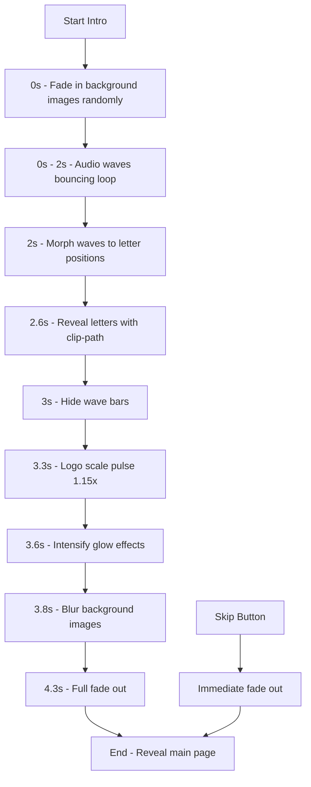

# Plan: EHDU Intro Animation Preloader

## Overview
Create a complex, cinematic intro animation using GSAP with the provided color scheme and assets. The animation will feature:
- 6-8 DJ/concert background images fading in randomly
- 4 audio wave bars that morph into the EHDU logo
- Total duration: 4.5 seconds
- Skip button functionality

---

## Resources Analysis

### Available Images (public/Cover/)
- 15 .webp images available for background
- Selected images will be randomly chosen for the animation
- Images: `295517864_424022863017902_5930398495976906243_n.webp`, `AfterlightImage (3).webp`, `banana sesions foto4.webp`, `Copia de 1.webp`, `Copia de IMG_7735.webp`, `Copia de IMG_7736.webp`, `DSC02632.webp`, `DSC08862.webp`, `DSC08865.webp`, `image00190.webp`, `image00241.webp`, `IMG_2569.webp`, `IMG_6358.webp`, `IMG_6365.webp`, `P_P04006.webp`

### Existing Codebase
- **GSAP** is already installed and used in App.tsx
- **PageLoader.tsx** exists in `components/animations/` - will be replaced
- **Tailwind CSS** is being used for styling
- **DynamicBackground.tsx** already exists - may need coordination

---

## Implementation Plan

### Phase 1: Component Structure

```
components/animations/
├── IntroAnimation.tsx  (NEW - main component)
└── PageLoader.tsx     (keep as fallback or remove)
```

### Phase 2: Design Specifications

#### Color Scheme
| Element | Color | Usage |
|---------|-------|-------|
| Primary | `#00F0FF` | Cyan - main accent |
| Secondary | `#8B00FF` | Purple - secondary accent |
| Background | `#000000` | Black - base |
| Text | `#FFFFFF` | White - content |
| Glow | `rgba(0,240,255,0.5)` | Cyan glow |

#### Background Images Layer
- 6-8 images randomly selected from Cover folder
- Each image: opacity 30%, brightness 60%
- Random position (0-85% for both axes)
- Random rotation (-20deg to +20deg)
- Random scale (0.8 to 1.2)
- Staggered delays: 0-1.5s
- Cyan/purple glow border: `box-shadow: 0 0 15px rgba(0,240,255,0.3)`
- Border radius: 12px
- Initial state: opacity 0, scale 0.8

#### Audio Waves (4 bars)
- Container: centered, flex, gap 24px
- Each bar: width 14px, height 50px (bounces 20-80px)
- Border radius: 7px (rounded tops)
- Alternating gradients:
  - Bar 1 & 3: `linear-gradient(to top, #00F0FF, #8B00FF)`
  - Bar 2 & 4: `linear-gradient(to top, #8B00FF, #00F0FF)`
- Glow: `box-shadow: 0 0 25px currentColor`
- Animation: 2 seconds bounce loop

#### EHDU Logo Morph
- Font: Arial Black or bold sans-serif
- Size: 130px (desktop), 80px (mobile)
- Letter spacing: 12-20px
- Gradient fill with background-clip: text
- Text shadow effects
- Initial state: hidden behind wave bars
- Morph transition: 1s ease-out

#### Skip Button
- Position: top-right
- Color: white, opacity 50%
- Style: rounded pill, backdrop blur
- Hover: increases visibility

---

## GSAP Timeline Breakdown

### Total Duration: 4.5 seconds

```
Timeline:
├── 0s - 1s:        Background images fade in (staggered)
├── 0s - 2s:        Audio waves bounce (continuous)
├── 2s - 3.2s:      Waves morph to letter positions
├── 2.6s - 3.4s:    Letters reveal (clip-path)
├── 3s - 3.5s:      Waves fade out
├── 3.3s - 3.9s:    Logo scale 1.15x pulse
├── 3.6s - 4.1s:    Glow intensifies
├── 3.8s - 4.3s:    Background blur
├── 4.3s - 4.5s:    Full fade out
```

### Detailed GSAP Code Structure

```typescript
const tl = gsap.timeline({
  onComplete: () => !isSkipped && onComplete?.()
});

// 1. Background images fade in (0-1s)
tl.to('.intro-img', {
  opacity: 0.35,
  scale: 1,
  duration: 1,
  stagger: { each: 0.15, from: 'random' },
  ease: 'power2.out'
}, 0);

// 2. Audio waves bounce (0-2s) - parallel with images
tl.to('.wave-bar', {
  scaleY: (i) => 0.4 + Math.random() * 0.6,
  duration: 0.35,
  yoyo: true,
  repeat: 5,
  stagger: { each: 0.07, repeat: 5 },
  ease: 'sine.inOut'
}, 0);

// 3. Morph waves to letter shapes (2s - 3.2s)
tl.to('.wave-bar', {
  width: (i) => [90, 70, 75, 85][i],  // Approximate letter widths
  height: 140,
  borderRadius: 8,
  duration: 1.2,
  stagger: 0.1,
  ease: 'elastic.out(1, 0.6)'
}, 2);

// 4. Reveal letters with clip-path (2.6s - 3.4s)
tl.to('.intro-letter', {
  clipPath: 'inset(0% 0% 0% 0%)',
  opacity: 1,
  duration: 0.8,
  stagger: 0.12,
  ease: 'power3.out'
}, '-=0.8');

// 5. Hide wave bars (3s - 3.5s)
tl.to('.wave-bar', {
  opacity: 0,
  duration: 0.5
}, '-=0.3');

// 6. Logo scale pulse (3.3s - 3.9s)
tl.to('.intro-logo', {
  scale: 1.15,
  duration: 0.6,
  ease: 'back.out(1.4)'
}, '-=0.2');

// 7. Intensify glow (3.6s - 4.1s)
tl.to('.intro-letter', {
  textShadow: `
    0 0 25px rgba(0,240,255,1),
    0 0 50px rgba(139,0,255,0.8),
    0 0 75px rgba(0,240,255,0.6),
    0 0 100px rgba(139,0,255,0.4)
  `,
  duration: 0.5
}, '-=0.3');

// 8. Blur background images (3.8s - 4.3s)
tl.to('.intro-img', {
  filter: 'blur(15px) brightness(0.3)',
  duration: 0.8,
  ease: 'power2.in'
}, '-=0.2');

// 9. Full fade out (4.3s - 4.5s)
tl.to(loaderRef.current, {
  opacity: 0,
  duration: 1.2,
  ease: 'power2.inOut'
}, '+=0.2');
```

---

## Phase 3: File Creation Steps

### Step 1: Create `IntroAnimation.tsx`

```typescript
// Key imports
import { useEffect, useRef, useState, useMemo } from 'react';
import gsap from 'gsap';

// Props interface
interface IntroAnimationProps {
  onComplete?: () => void;
}

// Component structure
const IntroAnimation: React.FC<IntroAnimationProps> = ({ onComplete }) => {
  const loaderRef = useRef<HTMLDivElement>(null);
  const [isSkipped, setIsSkipped] = useState(false);
  
  // Memoized random positions for consistency
  const imagePositions = useMemo(() => {
    return Array.from({ length: 8 }, (_, i) => ({
      id: i,
      left: `${Math.random() * 85}%`,
      top: `${Math.random() * 85}%`,
      rotation: Math.random() * 40 - 20,
      scale: 0.8 + Math.random() * 0.4,
      imgIndex: i % 15  // Cycle through available images
    }));
  }, []);
  
  // Image list from public/Cover/
  const coverImages = [
    '/Cover/295517864_424022863017902_5930398495976906243_n.webp',
    '/Cover/AfterlightImage (3).webp',
    '/Cover/banana sesions foto4.webp',
    '/Cover/Copia de 1.webp',
    '/Cover/Copia de IMG_7735.webp',
    '/Cover/Copia de IMG_7736.webp',
    '/Cover/DSC02632.webp',
    '/Cover/DSC08862.webp',
    '/Cover/DSC08865.webp',
    '/Cover/image00190.webp',
    '/Cover/image00241.webp',
    '/Cover/IMG_2569.webp',
    '/Cover/IMG_6358.webp',
    '/Cover/IMG_6365.webp',
    '/Cover/P_P04006.webp',
  ];
  
  // GSAP timeline in useEffect
  // ... (timeline code from above)
  
  return (
    <div ref={loaderRef} className="intro-container">
      <style>{/* CSS styles */}</style>
      {/* Background images */}
      <div className="intro-images">
        {imagePositions.map((pos) => (
          
        ))}
      </div>
      {/* Wave bars container */}
      <div className="intro-waves">
        {[0, 1, 2, 3].map(i => (
          <div key={i} className="wave-bar-wrapper">
            <div className="wave-bar" />
          </div>
        ))}
      </div>
      {/* EHDU letters */}
      <div className="intro-logo">
        {['E', 'H', 'D', 'U'].map((letter, i) => (
          <span key={i} className="intro-letter">{letter}</span>
        ))}
      </div>
      {/* Skip button */}
      <button onClick={handleSkip} className="intro-skip">
        Skip Intro
      </button>
    </div>
  );
};
```

### Step 2: Update `App.tsx`

```typescript
// Replace
import { PageLoader } from './components/animations';

// With
import { IntroAnimation } from './components/animations';

// Replace component usage
<PageLoader />
// With
<IntroAnimation onComplete={() => console.log('Intro completed')} />
```

### Step 3: Update `components/animations/index.ts`

```typescript
export { default as IntroAnimation } from './IntroAnimation';
// Optionally remove or keep PageLoader
```

---

## Phase 4: CSS Architecture

### CSS Variables
```css
:root {
  --color-cyan: #00F0FF;
  --color-purple: #8B00FF;
  --color-black: #000000;
  --color-white: #FFFFFF;
  --glow-cyan: rgba(0, 240, 255, 0.5);
}
```

### Component Styles
```css
.intro-container {
  position: fixed;
  inset: 0;
  background: var(--color-black);
  z-index: 99999;
  overflow: hidden;
}

.intro-images {
  position: absolute;
  inset: 0;
}

.intro-img {
  position: absolute;
  width: 280px;
  height: 180px;
  object-fit: cover;
  opacity: 0;
  border-radius: 12px;
  filter: brightness(0.6);
  box-shadow: 
    0 0 20px rgba(0, 240, 255, 0.25),
    0 0 40px rgba(139, 0, 255, 0.15);
  border: 1px solid rgba(0, 240, 255, 0.2);
}

.intro-waves {
  position: absolute;
  top: 50%;
  left: 50%;
  transform: translate(-50%, -50%);
  display: flex;
  gap: 24px;
  align-items: flex-end;
  height: 100px;
}

.wave-bar {
  width: 14px;
  height: 50px;
  border-radius: 7px;
  box-shadow: 0 0 25px currentColor;
  transform-origin: bottom;
}

.wave-bar:nth-child(1),
.wave-bar:nth-child(3) {
  background: linear-gradient(to top, var(--color-cyan), var(--color-purple));
}

.wave-bar:nth-child(2),
.wave-bar:nth-child(4) {
  background: linear-gradient(to top, var(--color-purple), var(--color-cyan));
}

.intro-logo {
  position: absolute;
  top: 50%;
  left: 50%;
  transform: translate(-50%, -50%);
  display: flex;
  gap: 8px;
  letter-spacing: 12px;
}

.intro-letter {
  font-size: 130px;
  font-weight: 900;
  font-family: 'Arial Black', 'Impact', sans-serif;
  background: linear-gradient(135deg, var(--color-cyan) 0%, var(--color-purple) 100%);
  -webkit-background-clip: text;
  -webkit-text-fill-color: transparent;
  background-clip: text;
  opacity: 0;
  clip-path: inset(100% 0% 0% 0%);
  text-shadow: 
    0 0 15px rgba(0, 240, 255, 0.8),
    0 0 30px rgba(139, 0, 255, 0.6),
    0 0 45px rgba(0, 240, 255, 0.4);
}

.intro-skip {
  position: absolute;
  top: 30px;
  right: 30px;
  color: rgba(255, 255, 255, 0.5);
  background: rgba(255, 255, 255, 0.05);
  border: 1px solid rgba(255, 255, 255, 0.1);
  padding: 12px 24px;
  border-radius: 30px;
  font-size: 14px;
  font-weight: 600;
  cursor: pointer;
  backdrop-filter: blur(10px);
  transition: all 0.3s ease;
}

.intro-skip:hover {
  color: #fff;
  background: rgba(0, 240, 255, 0.1);
  border-color: rgba(0, 240, 255, 0.3);
  box-shadow: 0 0 20px rgba(0, 240, 255, 0.3);
}

/* Mobile Responsive */
@media (max-width: 768px) {
  .intro-img {
    width: 180px;
    height: 120px;
  }
  
  .intro-letter {
    font-size: 80px;
  }
  
  .intro-waves {
    gap: 16px;
  }
  
  .wave-bar {
    width: 10px;
    height: 40px;
  }
}
```

---

## Phase 5: Animation Flow Diagram



---

## Phase 6: Error Handling

### Image Fallback
- On error, images hide themselves gracefully
- Fallback gradient or solid color if all images fail
- Error doesn't interrupt animation flow

### Skip Functionality
- Immediate GSAP kill of timeline
- Smooth fade out over 0.5s
- Callback triggers page reveal

### Memory Cleanup
- `gsap.context()` for proper cleanup
- `ctx.revert()` in useEffect cleanup
- Event listener removal

---

## Phase 7: Testing Checklist

- [ ] All 15 cover images load correctly
- [ ] Random positioning works on each page load
- [ ] Animation timing (4.5s total) feels natural
- [ ] Skip button works at any point
- [ ] Mobile responsive styles applied
- [ ] No memory leaks on component unmount
- [ ] Colors match specification exactly
- [ ] Glow effects render properly
- [ ] Letter morph animation is smooth
- [ ] Background blur transition is seamless

---

## Estimated Complexity: HIGH

This implementation involves:
- Complex multi-stage GSAP timeline
- Dynamic random positioning
- SVG/CSS morphing effects
- Responsive design considerations
- Proper cleanup and state management
